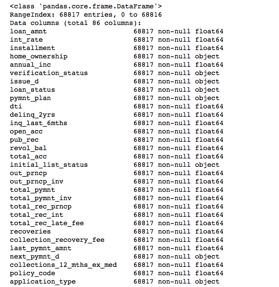
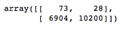
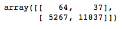
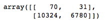
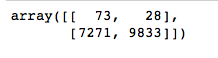
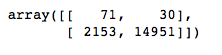

# Credit Risk Analysis

[Module 1](https://trilogyed.instructure.com/courses/626/pages/1-dot-0-1-predicting-credit-risk?module_item_id=32015) is to use Python to build and evaluate machine learning models to predict credit risk. Specifically, oversampling (`RandomOverSampler`, `SMOTE`), undersampling (`ClusterCentroids`) and a combinatorial approach of over- and undersampling (`SMOTEEN`) is utilized to evavluate credit risk.

Furthermore, two new machine learning models that reduce bias, [`BalancedRandomForestClassifier`](https://imbalanced-learn.org/stable/references/generated/imblearn.ensemble.BalancedRandomForestClassifier.html) and [`EasyEnsembleClassifier`](https://imbalanced-learn.org/stable/references/generated/imblearn.ensemble.EasyEnsembleClassifier.html) are evaluated for performance and recommendation.

## Analysis

The procedures listed above were done for 

1. Deliverable 1: Use Resampling Models to Predict Credit Risk (30 points)
2. Deliverable 2: Use the SMOTEENN algorithm to Predict Credit Risk (15 points)
3. Deliverable 3: Use Ensemble Classifiers to Predict Credit Risk (25 points)

### Data Proprocessing and Train/Test Splitting

#### Load the Data

Preliminary processing (shown below) was done during data injest so that the [DataFrame](https://pandas.pydata.org/pandas-docs/stable/user_guide/dsintro.html#intro-to-data-structures) is easier to manipulate.

```python
# Load the data
file_path = Path('LoanStats_2019Q1.csv')
df = pd.read_csv(file_path, skiprows=1)[:-2]
df = df.loc[:, columns].copy()

# Drop the null columns where all values are null
df = df.dropna(axis='columns', how='all')

# Drop the null rows
df = df.dropna()

# Remove the `Issued` loan status
issued_mask = df['loan_status'] != 'Issued'
df = df.loc[issued_mask]

# convert interest rate to numerical
df['int_rate'] = df['int_rate'].str.replace('%', '')
df['int_rate'] = df['int_rate'].astype('float') / 100


# Convert the target column values to low_risk and high_risk based on their values
x = {'Current': 'low_risk'}   
df = df.replace(x)

x = dict.fromkeys(['Late (31-120 days)', 'Late (16-30 days)', 'Default', 'In Grace Period'], 'high_risk')    
df = df.replace(x)

df.reset_index(inplace=True, drop=True)

df.head()
```

However, from `df.info()`, some object based columns still exist. These are categorical data and must be addressed before continuing.



#### Training and Testing Split

```python
# Create our target
y = df[target

# Create our features
X = df.drop(columns=target)
s = df.dtypes == 'object'
obj_list = list(s[s].index)
```

Utilizing the `get_dummies` function, the remaining `object` columns are encoded.

`X_encoded = pd.get_dummies(X, columns=obj_list)`

`X_train, X_test, y_train, y_test = train_test_split(X_encoded, y, random_state=1)`

### Machine Learning Pipeline

For the Analysis, the following procedures have been accomplished:

* An accurary score for the model is calculated
* A confusion matrix has been generated
* An imbalanced classification report has been generated

for both **resampling** algorithms as well as **ensemble** algorithms.

## Results

### Resampling Algorithms

#### Oversampling

| Procedure | `RandomOverSampler` | `SMOTE` |
| --------- | ------------------- | ------- |
| Counter | {'loan_status': 1} | {'loan_status': 1} |
| Balanced Accuracy Score | 0.6595620039085293 | 0.662861851549982 |
| Confusion Matrix |  |  |

##### `RandomOverSampler` Imbalanced Classification Report


##### `SMOTE` Imbalanced Classification Report


#### Undersampling

| Procedure | `ClusterCentroids` |
| --------- | ------------------- |
| Counter | {'loan_status': 1} |
| Balanced Accuracy Score | 0.5447339051023905 |
| Confusion Matrix |  |

##### `ClusterCentroids` Imbalanced Classification Report


#### Combination (Over and Under) Sampling

| Procedure | `SMOTEENN` |
| --------- | ------------------- |
| Counter | {'loan_status': 1} |
| Balanced Accuracy Score | 0.5447339051023905 |
| Confusion Matrix |  |

##### `ClusterCentroids` Imbalanced Classification Report


### Ensemble Algorithms

| Procedure | `BalancedRandomForestClassifier` | `EasyEnsembleClassifier` |
| --------- | ------------------- | ------- |
| Balanced Accuracy Score | 0.7885466545953005 | 0.9316600714093861 |
| Confusion Matrix |  |  |

##### `BalancedRandomForestClassifier` Imbalanced Classification Report


##### `EasyEnsembleClassifier` Imbalanced Classification Report


## Summary